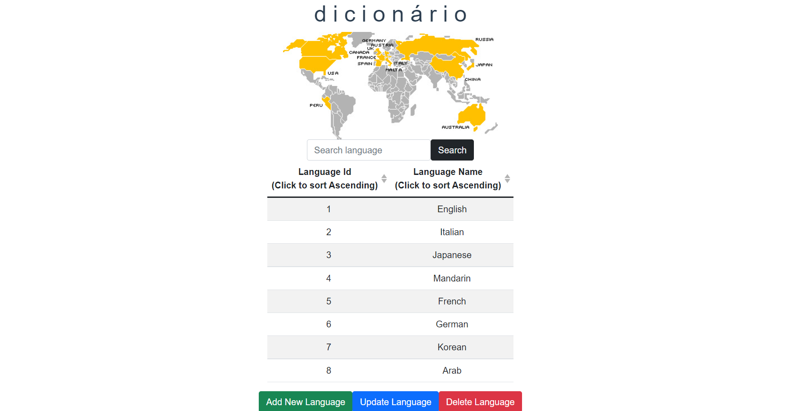

<div id="top"></div>
<!--
*** Thanks for checking out the Best-README-Template. If you have a suggestion
*** that would make this better, please fork the repo and create a pull request
*** or simply open an issue with the tag "enhancement".
*** Don't forget to give the project a star!
*** Thanks again! Now go create something AMAZING! :D
-->

<!-- PROJECT LOGO -->
<br />
<div>
  <h3 align="center">d i c i o n á r i o</h>
  <p align="center">contains various types of languages that exist in the world</p>
</div>

<!-- TABLE OF CONTENTS -->
<details>
  <summary>Table of Contents</summary>
  <ol>
    <li>
      <a href="#about-the-author">About The Author</a>
    </li>
    <li>
      <a href="#about-the-project">About The Project</a>
      <ul>
        <li><a href="#thd i c i o n á r i o">Dicionário</a></li>
	<li><a href="#built-with">Built With</a></li>
	<li><a href="#getting-started">Getting Startedh</a></li>
	<li><a href="#usage"Usage</a></li>
	<li><a href="#contributing">Contributing</a></li>
      </ul>
    </li>
  </ol>
</details>


<!-- ABOUT THE AUTHOR -->
# About The Author
Hello! I'm Farra Jessica or you can call me Jess, I'm the author of this project. I'm currently studying in computer engineering and informatics, class 3A - D4 Informatics Engineering. I am a student from Bandung city and have an interest in UI & UX in web development.

<!-- ABOUT THE PROJECT -->
# About The Project
This project was created to fulfill the middle examination in a web development course. Therefore, I build an application, namely:

## dicionário
<div>
	
</div>
dicionário (in português) or commonly known as a dictionary (in English) is an applications that contain various languages that can help us to translate a text from one language to another, but this project only containts the variety of language that can help the translator main machine.
 This application also has several features, including :
- Add language
- Search Language
- Update Language
- Delete language

<p align="right">(<a href="#top">back to top</a>)</p>

## Built With
* Node JS
* HTML
* CSS
* Vue JS
* Restful API

<p align="right">(<a href="#top">back to top</a>)</p>


<!-- GETTING STARTED -->
## Getting Started

### Installation

To add the project to your computer within this contribution you could do:
1. Open command prompt
2. `cd` to the destination that you desire on your PC
3. Clone the repository
	```sh 
	 https://github.com/FarraJessica/ETS_3A_Farra-Jessica.git
	 ```
by `git clone` `https://github.com/FarraJessica/ETS_3A_Farra-Jessica.git` command
4. Open the back-end folder inside the repository until you can see the content of back-end's folder and copy the path
5. Open command prompt, write `cd` and paste the path of back-end's folder, then install npm with `npm install` command
6. After the installation is complete, to run the back-end you can write `npm start` command
7. Open the front-end folder inside the repository until you can see the content of front-end's folder and copy the path
8. Open command prompt, write `cd` and paste the path of front-end's folder, then install npm with `npm install` command
9. After the installation is complete, to run the front-end you can write `npm run serve` command
10. Then the *d i c i o n á r i o* program has been installed, you can use the features in the UI of the application according to the usage below
<p align="right">(<a href="#top">back to top</a>)</p>


<!-- USAGE EXAMPLES -->
## Usage
To use this app, you can:
1. Add  new language, if there is a new language that is not in the list and you want to add it
2. Search language, if you want to check the presence of a language in the list
3. Update the language, if you want to update the language in the list because there is a writing error and so on
4. Delete the language, if there is a language that is no longer in use

<p align="right">(<a href="#top">back to top</a>)</p>


<!-- CONTRIBUTING -->
## Contributing

Contributions are what make the open source community such an amazing place to learn, inspire, and create. Any contributions you make are **greatly appreciated**.

If you have a suggestion that would make this better, please fork the repo and create a pull request. You can also simply open an issue with the tag "enhancement".

Don't forget to give the project a star! Thanks again!
